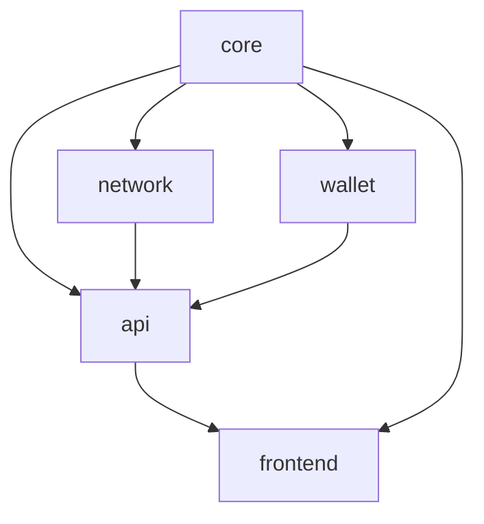

# DuxNet Module Index & Architecture

This document provides a detailed index of the main modules in the DuxNet project, their responsibilities, and how they interact. Use this as a reference for understanding and improving modularity.

---

## 📦 Main Modules (src/)

### 1. core/
- **Purpose:** Core platform logic and business rules.
- **Key Files:**
  - `identity.rs`: Digital identity management (DID, keys)
  - `dht.rs`: Distributed hash table for peer discovery/storage
  - `reputation.rs`: Reputation system and attestations
  - `escrow.rs`: Multi-signature escrow contracts
  - `tasks.rs`: Distributed task engine
  - `messaging.rs`: Messaging and communication
  - `data_structures.rs`: Shared types and data models
  - `community_fund.rs`: Community fund logic
  - `mod.rs`: Module aggregator

### 2. wallet/
- **Purpose:** Cryptocurrency wallet, transaction, and currency logic.
- **Key Files:**
  - `mod.rs`: Wallet implementation, currency support, transaction management

### 3. network/
- **Purpose:** P2P networking, node communication, and protocol logic.
- **Key Files:**
  - `mod.rs`: Network node, peer management, protocol handlers

### 4. api/
- **Purpose:** HTTP REST API endpoints for interacting with the platform.
- **Key Files:**
  - `mod.rs`: Main API server and endpoint routing
  - `dux_coin.rs`: DUX Coin-specific API logic

### 5. frontend/
- **Purpose:** Web interface logic (Rust-side, for Tauri integration).
- **Key Files:**
  - `mod.rs`: Frontend integration and logic

---

## 📈 Module Relationship Diagram

- **core** is the foundation, used by all other modules.
- **network** and **wallet** depend on core logic.
- **api** exposes core, wallet, and network via HTTP.
- **frontend** interacts with api and core for Tauri integration.

---

## 🛠️ Modularity & Refactoring Recommendations

- **Single Responsibility:** Each module should have a clear, focused purpose.
- **Reduce File Size:** Split large `mod.rs` files (>500 lines) into submodules (e.g., `handlers.rs`, `types.rs`).
- **Shared Types:** Move common types to `core/data_structures.rs` or a new `common/` module if used across modules.
- **Documentation:** Add doc comments at the top of each module and main file.
- **Testing:** Place module-specific tests in a `tests/` subdirectory or inline with `#[cfg(test)]`.

---

## 📚 See also:
- [README.md](./README.md) for project overview
- [CONTRIBUTING.md](./CONTRIBUTING.md) for development guidelines 